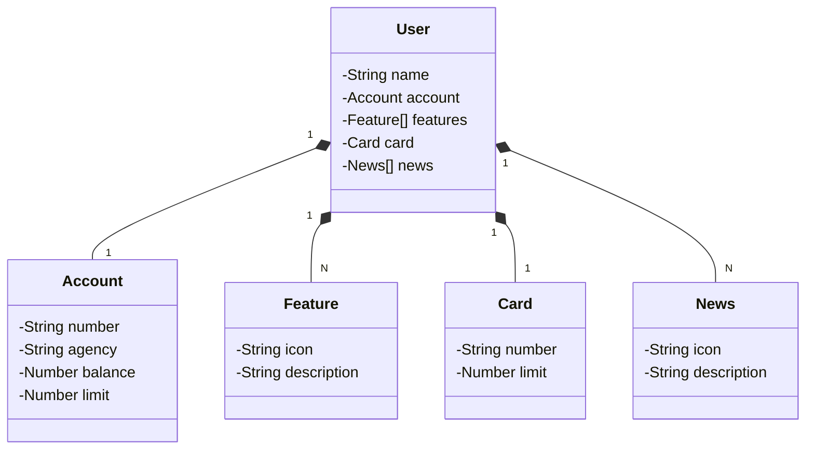

# Desafio Avanade - Bootcamp DIO - Java API

Este é o repositório do projeto desenvolvido durante o **Bootcamp Avanade** da **DIO (Digital Innovation One)**.

## 🎯 Desafio
O objetivo deste desafio foi aplicar os conhecimentos adquiridos no curso para construir uma API REST a partir do modelo de um APP do Banco Santander.

## 🚀 Tecnologias 

- **Java**
- **Spring Boot**
- **Spring Data JPA**
- **OpenAPI (Swagger)**
- **Railway**

## Diagrama de Classes (Domínio da API)

